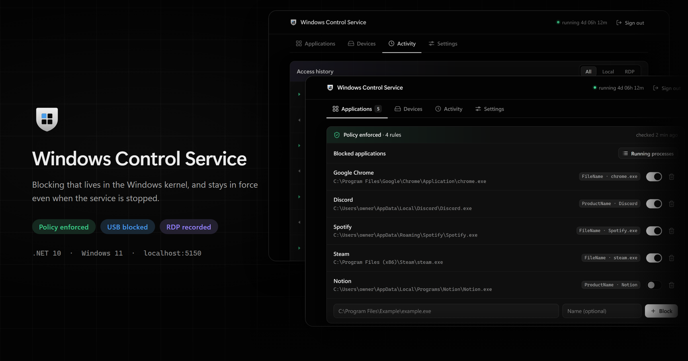

<p align="center">
  
</p>

# WindowsControlService

A Windows service that blocks applications with WDAC, blocks USB storage, and records when the machine was signed into.
One machine, one password, a web interface on `localhost`.

> That is the real interface, rendered by `banner/generate.mjs` against a simulated machine.
> Nothing in it is read from a real computer: the blocked applications are an example, and the
> addresses come from the ranges reserved for documentation.

## What it is

WDAC — Windows Defender Application Control — decides in the kernel whether an executable may run. This service
generates that policy, deploys it with `CiTool`, and puts an interface in front of it, so blocking an application is a
switch rather than hand-written XML.

Two things it holds against:

- **The service being stopped or uninstalled.** A deployed policy is enforced by the kernel and stays in force on its
  own. AppLocker, the obvious alternative, depends on a service an administrator can stop.
- **An executable being renamed.** Rules match on the `OriginalFilename` field of the PE header, not on a path.

## What it is not

**It is not a security boundary.** It installs and runs under an administrator account, and an administrator can stop
it, uninstall it, delete its database, remove the policy with
`CiTool --remove-policy`, or reinstall it and set a new password. Nothing here prevents any of that. It enforces a
decision already made; it does not hold against someone who wants it gone.

- **The policy is unsigned**, so removing it needs no key. The reconciliation worker redeploys it within a minute — that
  shortens the window, does not close it, and works only while the service is running. Signing the policy would close
  it, and is out of scope below.
- **A rule matches a field inside the file.** Edit the version resource of a copy and the rule stops matching it.
- **An executable with no version resource cannot be blocked at all.** It is refused rather than given a rule that would
  match nothing.
- **There are no user accounts.** One password guards the interface, and anyone who can reinstall does not need it.

## Requirements

- Windows 11 (tested on Pro 26200) with `CiTool.exe`, which ships with the system.
- Elevated PowerShell to install and operate.
- .NET SDK 10.0.1xx **to build only**. What is published is self-contained.

## Quick start

```powershell
.\scripts\build.ps1                       # publishes to .\publish
.\scripts\install.ps1 -From .\publish     # registers and starts the service

curl.exe http://localhost:5150/api/health
```

**Set the password before anything else.** Until one exists, the endpoint that sets it is public. Open
`http://localhost:5150/`, or from the command line:

```powershell
curl.exe -X POST http://localhost:5150/api/auth/password `
         -H "Content-Type: application/json" -d '{\"password\":\"<your password>\"}'
```

To remove everything:

```powershell
.\scripts\uninstall.ps1 -RemoveData
```

It stops the service, removes the WDAC policy, restores `USBSTOR`, and deletes the registration, the event source, the
binaries and the data. **The policy goes first and is verified**: if
`CiTool` still lists it, the script exits with an error and prints the command to remove it by hand.

## What it does

| Feature                           | Mechanism                                                                              |
|-----------------------------------|----------------------------------------------------------------------------------------|
| Application blocking              | A generated WDAC policy, converted to binary and deployed with `CiTool`                |
| Enable / disable without deleting | The policy is rebuilt and redeployed                                                   |
| Reconciliation                    | A worker compares the deployed policy against the database every minute                |
| USB storage blocking              | The `Start` value of `USBSTOR` in the registry                                         |
| Process inventory                 | Running processes, less anything under `C:\Windows`, named from their version resource |
| Access history                    | The Terminal Services log, a 30-day window, ingested in the background                 |
| Authentication                    | One password, a session cookie, an attempt limit                                       |
| REST API                          | `http://localhost:5150`, loopback only                                                 |
| Web interface                     | Served from the same origin, no framework and no build step                            |

Blocking `USBSTOR` stops new drives from mounting; it does not unmount drives already mounted.

**Out of scope:**

- **Failed sign-in attempts.** They need the Security log, which on the target machine retained only a few hours.
- **Blocking installers.** An installer cannot be told from an ordinary program at the executable level.
- **Signed WDAC policies.** They would remove the need for the reconciliation worker, but require a CA and custody of a
  private key.

## Documentation

| Document                                                 | What it is                                                                                              |
|----------------------------------------------------------|---------------------------------------------------------------------------------------------------------|
| [`docs/architecture.md`](docs/architecture.md)           | Shape of the solution, the patterns that do not change, known limits                                    |
| [`docs/windows-internals.md`](docs/windows-internals.md) | **WDAC, registry, event log, PE files, processes.** Behaviour that is not in the official documentation |
| [`docs/api.md`](docs/api.md)                             | The HTTP surface and the event stream                                                                   |
| [`docs/web-interface.md`](docs/web-interface.md)         | Module map, the behaviour rules, and the DOM harness                                                    |
| [`docs/operations.md`](docs/operations.md)               | Install, update, uninstall, diagnose, recover                                                           |
| [`docs/development.md`](docs/development.md)             | Toolchain, tests, packages, publishing                                                                  |
| [`DESIGN.md`](DESIGN.md)                                 | The design system the stylesheet transcribes                                                            |

## Development

```powershell
dotnet build                              # 0 warnings; TreatWarningsAsErrors is on
dotnet test                               # everything; the ones that touch the machine need elevation
dotnet test --filter "Requires!=Admin"

dotnet run --project src\WindowsControlService -- --data-dir .\.localdata --urls http://localhost:5151
```

## License

This project is licensed under the [MIT License](LICENSE).