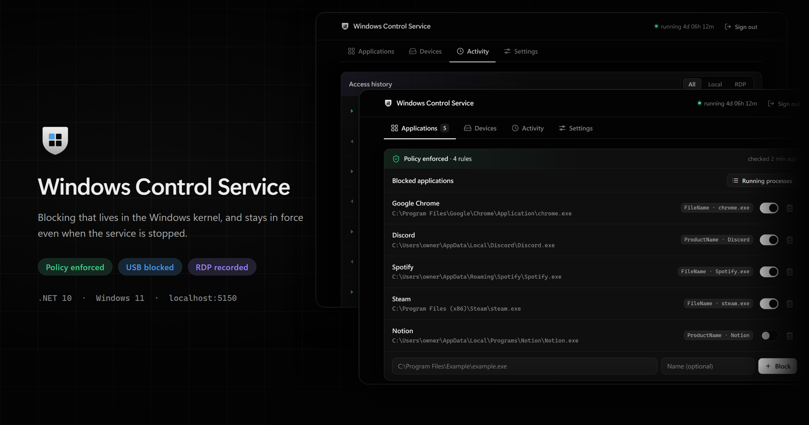

# Windows Control Service

A Windows service for a single Windows 11 machine. It blocks applications with a WDAC policy, blocks USB storage, and
lists sign-ins. It is managed through a password-protected web interface and API on `http://localhost:5150`.



## How it works

- **Blocking:** generates a WDAC policy and deploys it with `CiTool`. Every minute it compares the deployed policy with
  the database and redeploys it if they differ.
- **Rule matching:** a rule matches a field of the executable's version resource (`OriginalFilename`, else
  `InternalName` or `ProductName`), not its path. Renaming the file does not get around it.
- **USB storage:** sets `Start` of `HKLM\SYSTEM\CurrentControlSet\Services\USBSTOR` to `4`. Drives already mounted stay
  mounted.
- **Sign-in history:** reads the `TerminalServices-LocalSessionManager` log, local and RDP sessions, last 30 days.
- **Process list:** running processes outside `C:\Windows`, to choose what to block.
- **Access:** one password, a session cookie, a limit on sign-in attempts. Listens on loopback only.

## Limits

- **It does not stop an administrator.** An administrator can stop the service, uninstall it, or remove the policy with
  `CiTool`. The policy is unsigned; the service redeploys it within a minute, but only while it is running.
- **A block is only as reliable as the version resource.** Editing that resource in a copy of the executable makes the
  rule stop matching. An executable with no version resource cannot be blocked, and the service refuses it.
- **One password, no user accounts.**
- **Not covered:** failed sign-ins (they need the Security log), installers (not distinguishable from other programs at
  the executable level), signed policies.

## Risks to know before installing

- **A WDAC policy outlives the service.** Enforcement is done by the kernel, so stopping the service does not lift a
  block. Use `.\wcs uninstall`, which removes the policy first and checks that it is gone.
- **A wrong policy can stop legitimate programs from running.** Create a restore point before blocking applications:
  `.\wcs restore-point`.
- **Until a password is set, anyone on the machine can set it.** Set it right after installing.

## Requirements

- Windows 11 (tested on Pro, build 26200). `CiTool.exe` is included with it.
- Administrator rights to install and operate. `.\wcs` asks for them when needed.
- .NET SDK 10.0.1xx to build (`winget install Microsoft.DotNet.SDK.10`). The published service does not need it.

## Usage

```powershell
.\wcs deploy                  # build, then install or update; backs up the database before an update
.\wcs status                  # service, version, policy, USB storage, restore point, database
.\wcs uninstall               # remove the policy, restore USB storage, remove the service; keeps the data
.\wcs uninstall -RemoveData   # the same, and delete the database and logs
.\wcs                         # list every command
```

After the first deploy, open `http://localhost:5150/` and set the password.

Development:

```powershell
.\wcs dev     # run from source on http://localhost:5151 with its own database, hot reload
.\wcs test    # all tests; without administrator rights, skips the ones that touch the machine
```

## Documentation

| Document                                                 | Contents                                                        |
|----------------------------------------------------------|-----------------------------------------------------------------|
| [`docs/operations.md`](docs/operations.md)               | Install, update, uninstall, diagnose, recover                   |
| [`docs/development.md`](docs/development.md)             | Toolchain, commands, tests, schema changes, packages            |
| [`docs/architecture.md`](docs/architecture.md)           | Structure, patterns, known limits                               |
| [`docs/windows-internals.md`](docs/windows-internals.md) | Undocumented behaviour of WDAC, registry, event log, PE files   |
| [`docs/api.md`](docs/api.md)                             | HTTP API and event stream                                       |
| [`docs/web-interface.md`](docs/web-interface.md)         | Interface modules, behaviour rules, DOM harness                 |

## License

[MIT](LICENSE)
